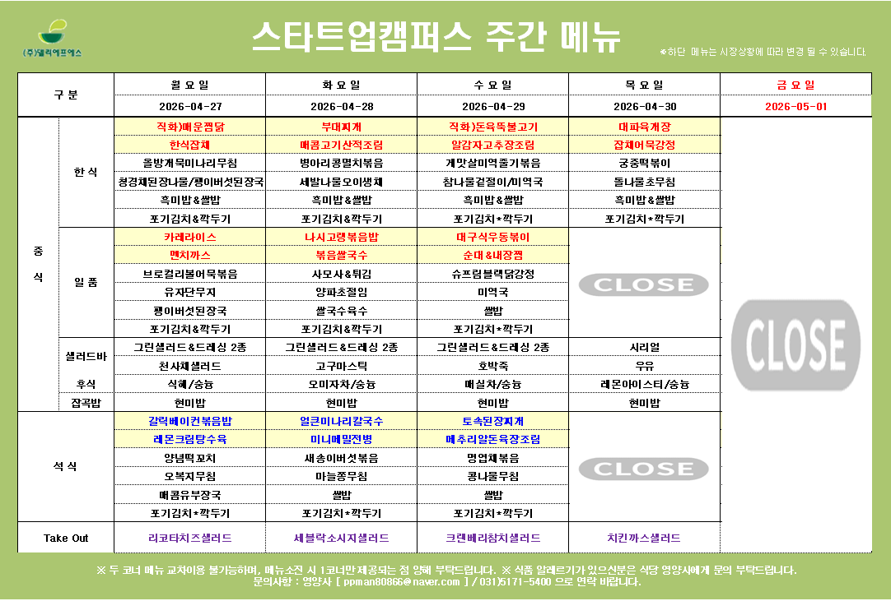

# Startup Campus Menu Slack Notifier

판교테크노밸리 공지사항에서 **스타트업캠퍼스 구내식당 주간 식단표**를 찾아 Slack 채널에 자동으로 올리는 GitHub Actions 템플릿입니다.

평일 10:30, 13:30, 16:30 KST에 식단표를 확인하고, 새 주차이거나 원본 첨부가 바뀌었을 때 Slack Incoming Webhook으로 식단표 이미지 또는 파일 링크를 보냅니다.



## Copy This Prompt

아래 프롬프트를 Codex, Claude Code, OpenCode 같은 coding agent에게 붙여넣으면 됩니다.

```text
아래 GitHub 템플릿을 읽고, 현재 저장소에 스타트업캠퍼스 구내식당 Slack 알림을 설치해줘.

https://github.com/Acacia-AbleJ/startupcampus-menu-slack

목표:
- 평일 10:30, 13:30, 16:30 KST에 GitHub Actions가 실행된다.
- 판교테크노밸리 공지사항에서 이번 주 스타트업캠퍼스 식단표 첨부를 찾는다.
- 새 주차이거나 원본 첨부가 바뀌었을 때 Slack Incoming Webhook으로 식단표 이미지 또는 파일 링크를 보낸다.

작업:
- 필요한 workflow, script, dependency 파일을 복사하거나 현재 저장소 구조에 맞게 병합한다.
- Slack Webhook URL은 코드에 넣지 않는다.
- GitHub Actions secret 이름은 SLACK_WEBHOOK_URL을 사용한다.
- 가능하면 dry-run으로 동작을 확인한다.
- 변경 내용을 요약하고, 내가 직접 해야 할 secret 등록 단계만 알려준다.
```

## How It Works

```text
평일 10:30, 13:30, 16:30 KST
→ 판교테크노밸리 공지사항 목록 조회
→ 이번 주 구내식당 주간메뉴표 게시글 선택
→ 스타트업캠퍼스 첨부 선택
→ 지난 전송 기록과 비교
→ 새 주차이거나 첨부가 바뀌었으면 Slack 채널에 이미지/파일 링크 전송
```

첨부가 PNG/JPG/GIF이면 Slack에 이미지로 표시합니다. PDF이면 원본 파일 링크를 보냅니다.

## Manual Setup

에이전트를 쓰지 않을 때만 아래 순서대로 설정합니다.

### 1. Slack Webhook 만들기

Slack에서 식단표를 받을 채널용 Incoming Webhook을 만듭니다.

Webhook을 만들 때 선택한 채널이 식단표를 받을 채널입니다. 코드에는 채널명을 넣지 않습니다.

### 2. GitHub Secret 등록

GitHub 저장소에서 아래 위치로 이동합니다.

```text
Settings → Secrets and variables → Actions → New repository secret
```

다음 secret을 추가합니다.

```text
Name: SLACK_WEBHOOK_URL
Value: https://hooks.slack.com/services/...
```

### 3. 테스트 실행

GitHub 저장소의 `Actions` 탭에서 `Startup Campus Menu`를 선택한 뒤 `Run workflow`를 실행합니다.

성공하면 Slack 채널에 식단표 메시지가 올라옵니다.

## Local Test

```bash
python -m venv .venv
source .venv/bin/activate
pip install -r requirements.txt
python scripts/post_menu.py --dry-run
```

특정 날짜 기준으로 테스트:

```bash
python scripts/post_menu.py --dry-run --date 2026-04-27
```

실제 Slack 전송:

```bash
SLACK_WEBHOOK_URL="https://hooks.slack.com/services/..." python scripts/post_menu.py
```

## Configuration

기본값으로 바로 사용할 수 있습니다. 필요할 때만 GitHub Actions 환경 변수로 조정하세요.

| Name | Default | Description |
| --- | --- | --- |
| `SLACK_WEBHOOK_URL` | required | Slack Incoming Webhook URL. GitHub Secret으로 저장합니다. |
| `MENU_BOARD_URL` | 판교테크노밸리 공지사항 | 식단표 공지사항 목록 URL |
| `MENU_TIMEZONE` | `Asia/Seoul` | 이번 주 계산에 사용할 시간대 |
| `POST_START_HOUR` | `9` | scheduled run 전송 허용 시작 시각 |
| `POST_END_HOUR` | `18` | scheduled run 전송 허용 종료 시각 |
| `POST_LOOKBACK_DAYS` | `0` | 이번 주 월요일보다 며칠 전 게시글까지 허용할지 |
| `MENU_STATE_PATH` | `.menu-state/startupcampus-menu.json` | 마지막 전송 기록 파일 |
| `FORCE_POST` | `false` | 같은 첨부여도 강제로 전송할지 |
| `BOT_USER_AGENT` | built in | 사이트 요청에 사용할 User-Agent |

## Schedule

기본 workflow는 평일 10:30, 13:30, 16:30 KST에 실행됩니다. GitHub Actions cron은 UTC 기준이므로 `30 1,4,7 * * 1-5`를 사용합니다.

```yaml
on:
  schedule:
    - cron: "30 1,4,7 * * 1-5"
```

GitHub Actions scheduled run은 지연될 수 있습니다. scheduled run이 KST 18시 이후에 시작되면 Slack 전송 없이 종료합니다.

## Security

- Slack Webhook URL은 GitHub Secret에만 저장합니다.
- Public 저장소에 Webhook URL을 커밋하지 않습니다.
- Actions 로그에 Webhook URL을 출력하지 않습니다.
